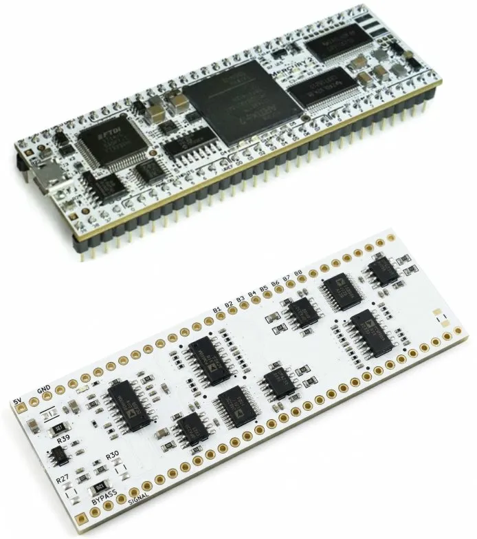
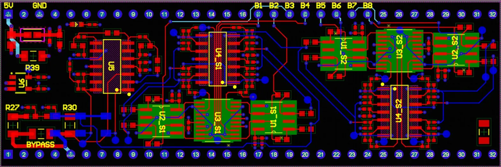

# Mercury CT-DSP Daughterboard

> An open-hardware analog front-end for continuous-time digital signal processing (CT-DSP) on the MicroNova Mercury 2 FPGA development board.



This project presents a low-cost, open-source analog daughterboard that converts real-world analog signals into asynchronous level-crossing events suitable for CT-DSP on an FPGA. Unlike conventional sampled-data DSP, CT-DSP processes signals event-driven — reacting only when a signal crosses a threshold — enabling ultra-low latency, reduced data rates, and power consumption that scales with signal activity rather than a fixed sampling clock.

This work was presented at **IEEE SoutheastCon 2026** by Darrin Hanna, Jason Gorski, Joseph Volcic, and Erik Rosenkranz (Oakland University / MicroNova LLC).

---

## Project Overview

Continuous-time digital signal processing (CT-DSP) has historically been confined to simulation or custom ASICs due to the lack of accessible hardware. This project lowers that barrier by providing a complete, reproducible open-hardware platform built around the commercially available MicroNova Mercury 2 FPGA module.

The daughterboard implements an **8-bit, 8-stage level-crossing pipeline architecture**, based on a staged design developed by the DEVCOM Army Research Laboratory. Each stage performs three operations:

1. **Compare** — the input signal is compared against a fixed 2.5 V reference threshold using a fast comparator
2. **Conditional Subtract** — if the input exceeds the threshold, the threshold voltage is subtracted, isolating the residue
3. **Amplify** — the residue is amplified by 2× and passed to the next stage

The comparator output from each stage is routed to the Mercury 2 FPGA, where transitions are detected as level-crossing events. The FPGA firmware timestamps these events and streams them to a host computer over UART/USB.

### System Performance

| Parameter | Value |
|-----------|-------|
| Input Range | 0 – 5 V |
| Resolution | 256 levels (8-bit) |
| Level Spacing | ~19.5 mV |
| Error-free bandwidth | 1.5 kHz (5 V p-p) |
| Worst-case settling time | 352.5 ns (0 V → 5 V step) |
| Single-bit settling time | 114.5 ns (center crossing) |

### Key Components

| Function | Part | Key Specs |
|----------|------|-----------|
| Comparator | TLV3502 | 4.5 ns propagation delay, 16 mV hysteresis |
| Analog Switch | ADG734 | 21 ns t_ON, 2.5 Ω R_ON |
| Stage Amplifier | ADA4891-4 | 170 V/µs slew rate, rail-to-rail output |
| Voltage Reference | REF2025 | 2.5 V precision reference |

### Event Data Format

The FPGA firmware transmits 5-byte packets over UART for each level-crossing event:

- **Bytes 0–3:** 32-bit timestamp (MSB first)
- **Byte 4:** 8-bit value field — either a delta/polarity word (polarity bit + 7-bit delta magnitude) or a direct 8-bit ADC reading

---

## Hardware Setup

### What You Need

- **MicroNova Mercury 2** FPGA development board ([micro-nova.com](https://www.micro-nova.com))
- **CT-DSP Daughterboard** (this project — fabricate from the provided Altium files or order via MicroNova)
- USB-A to Micro-USB cable
- 0–5 V analog signal source (function generator, sensor output, etc.)

### Assembly

1. Align the daughterboard's 64-pin DIP header with the Mercury 2's pin sockets
2. Press firmly to seat — the boards should be flush and parallel
3. Connect the analog input signal to the **SIGIN** pin (see schematic)
4. Apply 5 V and GND to the daughterboard power pins
5. Connect the Mercury 2 to your host computer via USB

### Board Layout



The PCB follows a modular two-stage-block design. Each block contains one comparator IC, one analog switch, and one amplifier section. Four such blocks are arranged in series across the board for the full 8-stage pipeline. Pin labels B1–B8 along the top edge correspond to the comparator outputs routed to the FPGA.

### Schematic


The analog signal path flows from input conditioning through dual comparator stages (U1, U2), into an analog MUX for conditional subtraction (U3), and through instrumentation amplifier stages (U4). The signal path repeats for stages 5–8 on the right half of the board.

---

## Getting Started

### Prerequisites

- **Xilinx Vivado** (2019.1 or later recommended) for VHDL synthesis and FPGA programming
- **Python 3.8+** for host-side data capture and analysis
- Python packages: `pyserial`, `numpy`, `matplotlib`

```bash
pip install pyserial numpy matplotlib
```

### Programming the FPGA

1. Open Vivado and create a new project targeting the **Artix-7 XC7A35T** (Mercury 2)
2. Add the provided VHDL source files from the `hdl/` directory
3. Apply the provided XDC constraints file for pin mapping
4. Run Synthesis → Implementation → Generate Bitstream
5. Program the Mercury 2 via the USB/JTAG interface

A pre-built bitstream is provided in `bitstream/` for quick start without requiring re-synthesis.

### Capturing Data with Python

Connect the Mercury 2 via USB. The FTDI interface will enumerate as a virtual COM port.

```bash
python sample/capture.py --port COM3 --baud 921600
```

Replace `COM3` with the appropriate port for your system (e.g., `/dev/ttyUSB0` on Linux).

Sample scripts in the `sample/` directory demonstrate:
- Real-time event capture and display
- Signal reconstruction from level-crossing events
- Basic CT-DSP analysis on captured data

---

## File Structure

```
Mercury-CTDSP/
├── altium/                  # Altium Designer hardware files
│   ├── *.SchDoc             # Schematics
│   ├── *.PcbDoc             # PCB layout
│   └── *.PrjPcb             # Project file
├── hdl/                     # VHDL firmware for Mercury 2
│   ├── ct_dsp_top.vhd       # Top-level design
│   ├── event_detector.vhd   # Edge detection and settling logic
│   ├── uart_tx.vhd          # UART transmitter
│   └── constraints.xdc      # Vivado pin constraints
├── bitstream/               # Pre-built FPGA bitstream
│   └── ct_dsp.bit
├── sample/                  # Sample Python scripts
│   ├── capture.py           # Real-time data capture
│   ├── reconstruct.py       # Signal reconstruction
│   └── plot_events.py       # Event visualization
├── images/                  # Documentation images
│   ├── ctdsp.png
│   ├── schematic.png
│   └── pcb.png
└── README.md
```

---

## Supported Use Cases

The platform is designed to support multiple entry points depending on background:

- **DSP Practitioners** — Use the pre-loaded bitstream out of the box; connect a signal and stream event data to Python for analysis, with no FPGA or circuit design required
- **FPGA Developers** — Modify the open VHDL source to implement custom CT-DSP processing blocks such as filters, feature detectors, or multi-channel configurations using standard Xilinx tools
- **Embedded Developers** — Deploy CT-DSP algorithms on the Mercury 2's MicroBlaze soft processor in C/C++ for real-time on-board processing
- **Hardware Designers** — Use the provided Altium schematics and PCB layouts as a starting point for custom analog front-end designs, fabricable through any standard PCB service

CT-DSP is particularly well-suited for **sparse signals** such as ECG/biomedical waveforms, speech and audio, and IMU/inertial sensing — applications where signal energy is concentrated in time or frequency, and conventional uniform sampling wastes computation and power.

---