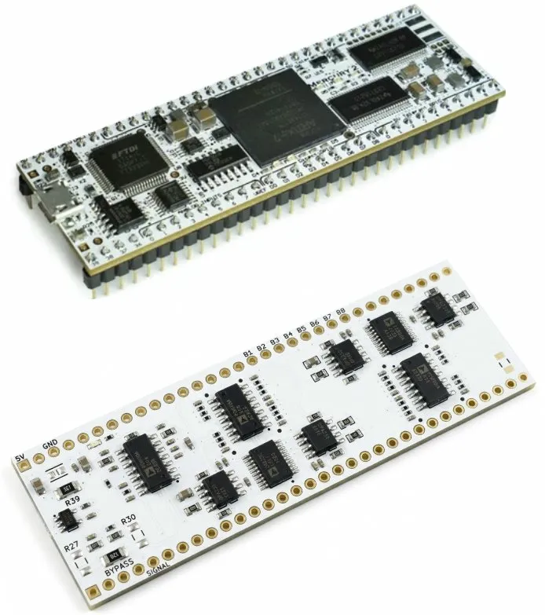
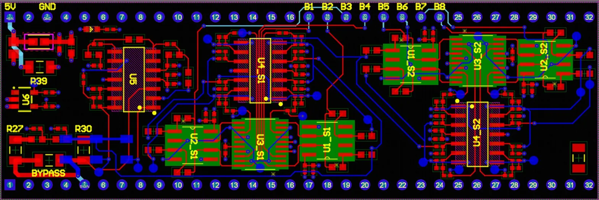
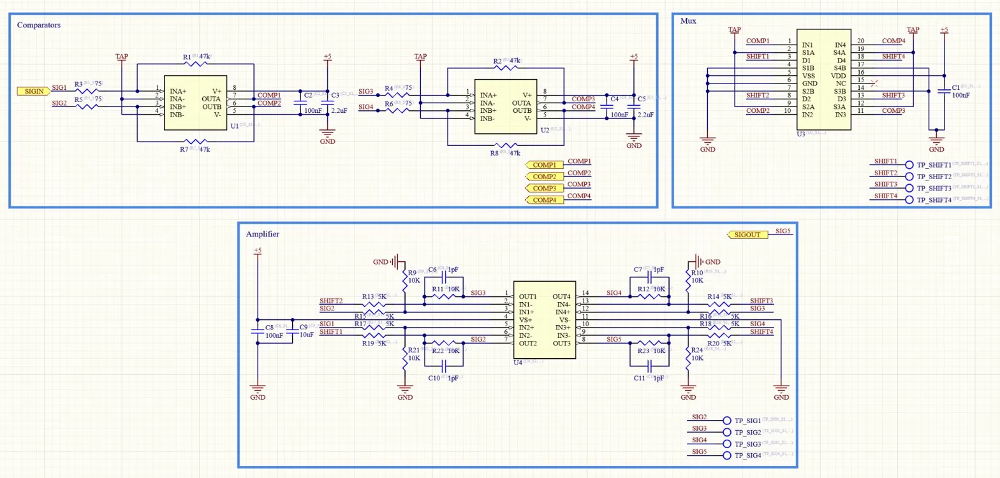

# Mercury CT-DSP Daughterboard

> An open-hardware analog front-end for continuous-time digital signal processing (CT-DSP) on the MicroNova Mercury 2 FPGA development board.



This project presents a low-cost, open-source analog daughterboard that converts real-world analog signals into asynchronous level-crossing events suitable for CT-DSP on an FPGA. Unlike conventional sampled-data DSP, CT-DSP processes signals event-driven — reacting only when a signal crosses a threshold — enabling ultra-low latency, reduced data rates, and power consumption that scales with signal activity rather than a fixed sampling clock.

This work was presented at **IEEE SoutheastCon 2026** by Darrin Hanna, Jason Gorski, Joseph Volcic, and Erik Rosenkranz (Oakland University / MicroNova LLC).

---

## Project Overview

Continuous-time digital signal processing (CT-DSP) has historically been confined to simulation or custom ASICs due to the lack of accessible hardware. This project lowers that barrier by providing a complete, reproducible open-hardware platform built around the commercially available MicroNova Mercury 2 FPGA module.

The daughterboard implements an **8-bit, 8-stage level-crossing pipeline architecture**, based on a staged design developed by the DEVCOM Army Research Laboratory. Each stage performs three operations:

1. **Compare** — the input signal is compared against a fixed 2.5 V reference threshold using a fast comparator
2. **Conditional Subtract** — if the input exceeds the threshold, the threshold voltage is subtracted, isolating the residue
3. **Amplify** — the residue is amplified by 2× and passed to the next stage

The comparator output from each stage is routed to the Mercury 2 FPGA, where transitions are detected as level-crossing events. The FPGA firmware timestamps these events and streams them to a host computer over UART/USB.

### System Performance

| Parameter | Value |
|-----------|-------|
| Input Range | 0 – 5 V |
| Resolution | 256 levels (8-bit) |
| Level Spacing | ~19.5 mV |
| Error-free bandwidth | 1.5 kHz (5 V p-p) |
| Worst-case settling time | 352.5 ns (0 V → 5 V step) |
| Single-bit settling time | 114.5 ns (center crossing) |

### Key Components

| Function | Part | Key Specs |
|----------|------|-----------|
| Comparator | TLV3502 | 4.5 ns propagation delay, 16 mV hysteresis |
| Analog Switch | ADG734 | 21 ns t_ON, 2.5 Ω R_ON |
| Stage Amplifier | ADA4891-4 | 170 V/µs slew rate, rail-to-rail output |
| Voltage Reference | REF2025 | 2.5 V precision reference |

### Event Data Format

The link runs a framed, bidirectional protocol (**v2**, firmware ID `0x00000003`) at 3 Mbaud with RTS/CTS flow control. Every frame is COBS-encoded and terminated by a single `0x00` byte, so a `0x00` can never occur inside a frame and resynchronising after a dropped byte is simply "scan to the next `0x00`":

```
<COBS(payload)> 0x00        payload = [type:1] [body...] [crc16:2 LE]
```

`crc16` is CRC-16/CCITT-FALSE over the type byte and body. Device-to-host frame types are `EVENT_BATCH` (`0x01`), `STATUS` (`0x02`), `HELLO` (`0x03`) and `ACK` (`0x04`); the host can send `PING`, `START`, `STOP`, `RESET`, `GET_STATUS`, `SET_SETTLING` and `SET_BATCH`.

Events ship in batches rather than one packet each:

```
EVENT_BATCH  [seq:1][abs_ts:6][n:1][ev_0 .. ev_(n-1)]      ev = [varint dt][bits:1]
```

`abs_ts` is a 48-bit free-running tick count at the device clock rate reported by `HELLO`, and each event's timestamp is the running sum of the deltas. Because every batch carries its own absolute anchor, a lost frame costs exactly that frame — the next one re-anchors itself with no host intervention. `seq` increments per frame and wraps at 256, giving the host a definitive loss detector.

The wire format is specified in full at the top of `Python/ctdsp/protocol.py` and is mirrored bit-for-bit by `frame_tx.vhd` and `cmd_rx.vhd` in the VHDL.

---

## Hardware Setup

### What You Need

- **MicroNova Mercury 2** FPGA development board ([micro-nova.com](https://www.micro-nova.com))
- **CT-DSP Daughterboard** (this project — fabricate from the provided Altium files or order via MicroNova)
- USB-A to Micro-USB cable
- 0–5 V analog signal source (function generator, sensor output, etc.)

### Assembly

1. Align the daughterboard's 64-pin DIP header with the Mercury 2's pin sockets
2. Press firmly to seat — the boards should be flush and parallel
3. Connect the analog input signal to the **SIGIN** pin (see schematic)
4. Apply 5 V and GND to the daughterboard power pins
5. Connect the Mercury 2 to your host computer via USB

### Board Layout



The PCB follows a modular two-stage-block design. Each block contains one comparator IC, one analog switch, and one amplifier section. Four such blocks are arranged in series across the board for the full 8-stage pipeline. Pin labels B1–B8 along the top edge correspond to the comparator outputs routed to the FPGA.

### Schematic



The analog signal path flows from input conditioning through dual comparator stages (U1, U2), into an analog MUX for conditional subtraction (U3), and through instrumentation amplifier stages (U4). The signal path repeats for stages 5–8 on the right half of the board.

---

## Getting Started

### Prerequisites

- **Xilinx Vivado** (2019.1 or later recommended) for VHDL synthesis and FPGA programming
- **Python 3.8+** for host-side data capture and analysis
- Python packages: `pyserial`, `numpy`, `pyqtgraph`, `PyQt5`

```bash
pip install -r Python/requirements.txt
```

Only the live plot needs `pyqtgraph`/`PyQt5`. The codec, the device session and the CLI import cleanly without a GUI stack, so headless capture over SSH or in CI works with just `pyserial` and `numpy`.

### Programming the FPGA

1. Open Vivado and create a new project targeting the **Artix-7 XC7A35T** (Mercury 2)
2. Add the VHDL sources and the `mercury.xdc` constraints file from the Vivado project in `HDL/CT-DSP.zip`
3. Run Synthesis → Implementation → Generate Bitstream
4. Program the Mercury 2 via the USB/JTAG interface

To skip synthesis entirely, program the pre-built **`HDL/dsp_top.bit`** directly. This is the bitstream the Python package expects: protocol v2, firmware ID `0x00000003`.

### Capturing Data with Python

Connect the Mercury 2 via USB. The FTDI part exposes two interfaces and **the CT-DSP is on channel B** — on a bench with more than one FTDI device, pass the port explicitly rather than relying on auto-detection.

```bash
cd Python
pip install -r requirements.txt
```

The fastest check after flashing is a `ping`. A successful `HELLO` confirms the baud rate, framing, CRC and the device's reported clock all at once, before any streaming is involved:

```bash
python -m ctdsp.cli ports              # list serial ports
python -m ctdsp.cli ping COM11         # handshake: protocol, firmware id, clock
python -m ctdsp.cli capture COM11 --count 1000 --csv out.csv
```

For the live plot:

```bash
python receive_ctdsp.py COM11 --window 5 --ticks --time-span 2
```

Three lines is the whole API:

```python
import ctdsp

dev = ctdsp.receive("COM11")                        # opens port, handshakes, streams
ctdsp.plot(dev, window=5, ticks=True, time_span=2)  # live reconstruction
```

`ctdsp.receive()` performs the `HELLO` handshake on open, so a bad baud rate, a stale bitstream or a dead board fails immediately instead of showing up as silence later. `CtdspDevice` is a context manager and `dev.events()` yields decoded events, so headless capture needs no GUI stack:

```python
with ctdsp.receive("COM11") as dev:
    hz = dev.hello.clk_freq_hz          # tick rate comes from the device, not a constant
    for event in dev.events(timeout=5):
        print(event.ticks / hz, event.bits)   # seconds, 8-bit comparator snapshot
```

See `Python/example.py` for the plotting entry point and `python -m ctdsp.selftest` for a self-check of the codec and link.

---

## File Structure

```
Mercury-CTDSP/
├── Altium/                  # Altium Designer hardware files
│   ├── *.SchDoc             # Schematics
│   ├── *.PcbDoc             # PCB layout
│   ├── *.PrjPcb             # Project file
│   ├── ctdsp-v4/            # Revision 4 board
│   └── Project Outputs/     # Gerbers, drill files, pick-and-place, BOM
├── HDL/                     # FPGA firmware for Mercury 2
│   ├── dsp_top.bit          # Pre-built bitstream (proto v2, fw 0x00000003)
│   └── CT-DSP.zip           # Full Vivado 2019.1 project and VHDL sources
├── Python/                  # Host-side capture, decode and plotting
│   ├── ctdsp/
│   │   ├── protocol.py      # Wire-format codec, no I/O
│   │   ├── device.py        # Serial session: handshake, commands, events
│   │   ├── view.py          # Filters and the live plot
│   │   ├── cli.py           # Bring-up tool: ports, ping, status, capture
│   │   └── selftest.py      # Codec and link self-check
│   ├── receive_ctdsp.py     # Live plot, command-line front end
│   ├── example.py           # Minimal three-line usage example
│   └── requirements.txt
├── LTspice3bitstage/        # LTspice simulations of the stage circuit
├── images/                  # Documentation images
│   ├── ctdsp.png
│   ├── Schematic.png
│   └── pcb.png
└── README.md
```

---

## Supported Use Cases

The platform is designed to support multiple entry points depending on background:

- **DSP Practitioners** — Use the pre-loaded bitstream out of the box; connect a signal and stream event data to Python for analysis, with no FPGA or circuit design required
- **FPGA Developers** — Modify the open VHDL source to implement custom CT-DSP processing blocks such as filters, feature detectors, or multi-channel configurations using standard Xilinx tools
- **Embedded Developers** — Deploy CT-DSP algorithms on the Mercury 2's MicroBlaze soft processor in C/C++ for real-time on-board processing
- **Hardware Designers** — Use the provided Altium schematics and PCB layouts as a starting point for custom analog front-end designs, fabricable through any standard PCB service

CT-DSP is particularly well-suited for **sparse signals** such as ECG/biomedical waveforms, speech and audio, and IMU/inertial sensing — applications where signal energy is concentrated in time or frequency, and conventional uniform sampling wastes computation and power.

---